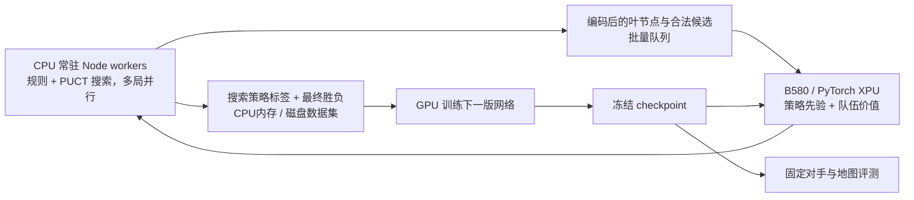

# Numeral Lord：以“昏晓”为目标的单张 B580 竞技 AI 训练路线

更新日期：2026-10-06（北京时间）。本文件按用户新确认的目标重新选型，取代旧报告中“先陪玩、PPO 优先”的默认顺序。

> **后续已被新要求取代：**不使用十回合临时胜负条件或时间折扣；始终按昏晓默认核心规则自然决胜。只过滤第 31 回合及之后的训练局面；此前局面仍可按整盘自然结果学习。本文其余进度、指纹、历史结果和临时规则讨论均仅作历史记录；当前执行规范见[本地实验 README](../experiments/hunxiao-ai/README.md)。

**当前进度：当前规则下的离线闭环已跑通，模型仍然很弱。** Node/TypeScript 读取本地共享规则并并行生成对局；Python/PyTorch 2.8.0+xpu 已在这台 B580 上完成实际训练和推理。当前实现是浅层规则搜索老师、PUCT、约 53.5 万参数策略/价值 MLP 和小规模自博弈，不是 AlphaZero 论文中的大规模系统。最新 pilot 使用“后手/先手兵力比 <1.1 先手胜、>1.3 后手胜、区间内平局”的终局规则，跑完 32 局和两轮自博弈；最终模型对浅搜索为 0 胜 6 负 2 平。它验证了规则、训练、XPU 与复盘流程，不构成顶级棋力证据。

此前的小试点曾有 1,024 个老师/自博弈样本、每批训练 200 步；一次对浅搜索老师的四局 arena 中仅一局结束且候选模型落败，其余局被旧动作上限截断。这些早期数据对应更旧的规则指纹，不是当前规则下的强度证据。历史检查点 `hunxiao-round10-pilot/iteration-1.pt` 的指纹为 `82430820799b18f7e0d681985a21d45acb70b46de9121ea2fdbe1d8bfa1a131c`；中间的“总兵力达到 1.2 倍”规则指纹为 `500dbb44004a86e48c6e003cb73e99e4dd277148719e10d3f87c068e64782e18`。当前最终规则 pilot 指纹为 `5cc869886d75c68c377c54cc303fae2d9a01fd6a029333adad2ec6729004927b`。运行器按规则/特征指纹阻止旧检查点冒充新规则模型。细节与命令见[本地实验 README](../experiments/hunxiao-ai/README.md)。

已确认：使用当前这台 i5-14600KF + Intel Arc B580 + 约 32GB 内存的电脑；第一阶段固定规则、双人两队，以用户提供的“昏晓”（ID 1001）为训练和主评测地图；目标至少与本游戏顶级人类棋手在这张图上相当；将来可在服务器或房主本地运行。

## 1. 明确推荐

**主线选小型策略/价值网络 + MCTS 搜索辅助自博弈，采用 Expert Iteration / AlphaZero 类训练。** 先完成普通 PUCT 搜索与训练闭环，再比较适合低搜索预算的 Gumbel AlphaZero。PPO 保留作同预算对照，无需把 PPO 作为前置阶段。

**规则与搜索继续用 Node/TypeScript，网络训练用 Python/PyTorch XPU。** 已在本机 B580 上验证训练与推理可用；需继续量化 CPU 搜索、合法动作生成和批量网络评估。只有它们成为明确瓶颈且优化后仍不足时，再考虑原生内核。

这是针对“已知精确规则、完全可见双人对局、追求高棋力”的工程推荐，不是已经证明本游戏中 AlphaZero 优于 PPO。现有资料也不足以保证这台机器能在某个天数内达到顶级；应以固定时间规则下对顶级玩家的结果验收。

### 1.1 第一阶段的地图与范围

用户提供的原始地图定义如下，保留原样，不将它注册为应用默认地图：

```json
{"version":1,"id":"1001","name":"昏晓","columns":9,"terrain":"AAAAAAABCBDAEEAEABAEEAAEAACBAEDABEABBAABBAABCBAEBADEABAAEAAEEACBAEAEEADBBAAAAAAAC","terrainLegend":{"A":"core/plain","B":"core/mountain","C":"core/void","D":"core/stronghold","E":"core/ocean"},"requiredTerrainModIds":[],"players":2,"playerNames":["玩家 1","玩家 2"],"playerColors":["#BB5F5F","#7BBB5E"],"soldiers":[[10,1,2],[11,1,1],[30,2,1],[50,1,1],[69,2,1],[70,2,2],[79,2,1]],"teams":[1,2],"matchConditionIds":[]}
```

按当前源码验证，可正常加载为 9×9、81 格的六边形棋盘，无半行。地形为平原 38、山地 16、虚无 5、据点 4、海洋 18；山地与虚无共 21 格不可驻兵，其余 60 格可驻兵。全部是 core 地形，无外部 Mod、特殊单位或自定义链接。

| 开局项 | 玩家 1 / team-1 | 玩家 2 / team-2 |
| --- | --- | --- |
| 初始单位数 / 总兵力 | 3 / 4 | 4 / 5 |
| 初始格索引（从 0 开始） | 10、11、50 | 30、69、70、79 |
| 行动顺序 | 先手 | 后手 |
| 回合开始的收益 | 开局已获得 3 点 | 开局尚为 0；首次自己回合开始获得 4 点 |

昏晓初始棋盘已由用户确认平衡，训练与评测必须使用这份固定地图定义；不得为方便训练而改动地形、兵力、落点或先后手。后手收益数值描述的是尚未改变初始占领和供电时的状态，先手行动可能影响后续实际收益，但不改变已确认的初始平衡设定。

**正式地图字段仍为空条件；本轮离线训练额外挂载一条临时实验胜负条件。** 失去全部据点即淘汰、最后存活队获胜仍优先；若双方完成第 10 个完整回合仍未决胜，则令 `r = 后手总兵力 / 先手总兵力`：`r < 1.1` 时先手获胜，`r > 1.3` 时后手获胜，`1.1 ≤ r ≤ 1.3` 时平局。实现用整数交叉相乘，阈值相等时均判平局。引擎在后手结束第 10 回合的加点后把内部 round 推进到 11，因此在这个边界结算；对外结果消息显示“第 10 回合结束”。该临时规则只在 `experiments/hunxiao-ai` 注册，不改地图、正式产品规则或共享核心目录。

当前实现有一个要在训练接入时处理的差异：用户原始地图写了 `matchConditionIds: []`，而[地图解析](C:/app/numeral-lord-next/packages/core-content/src/map-code.ts:392)与[引擎判胜](C:/app/numeral-lord-next/packages/game-core/src/engine.ts:1544)都用 `??` 处理缺失值，空数组会保留，当前网页新开局和 relay 也没有补上条件。默认模块确实存在，但原样直读这份 JSON 没有启用它们。这是当前源码行为，不据此推断已有线上对局的实际快照。

实验入口保留原始 `matchConditionIds: []`，并在环境快照中明确记录实际启用的两个默认条件和临时第十回合条件。达到动作上限依然只算截断，不算平局。临时规则改变了监督目标；移除它或换地图会生成不同环境指纹，旧检查点不会被当前运行器误载。

固定“昏晓”降低了规则和地图分布的复杂度，可以预计算拓扑并集中训练开局、供电争夺、海陆转换、据点攻防、反击消耗和加点分配。第一阶段的棋力声明只覆盖这张图及默认胜负规则，不外推到任意地图或 Mod。

### 1.2 专门针对“昏晓”的实验安排

1. 每局使用相同地图和初始兵力；网络同时训练两个席位。评测将 AI 对同一对手控制玩家 1、控制玩家 2 的成绩分开报告，再做配对比较。换 AI 所控制的席位，不等于交换地图中的初始兵力或修改先手顺序。
2. 首版用约 50 万～200 万参数的网络、普通 PUCT、常驻 CPU worker 和跨局批量推理；分别测 32/64/128 次模拟在真实战术局面的耗时与强度。先建立会争夺据点、保持供电的规则/浅搜索老师，检验其完局率；不一开始就投入大量纯随机对局。
3. 用根探索与历史对手避免所有对局只沿同一种开局展开；战术训练可从按真实规则到达的中盘局面继续，最终主评测仍从原始开局开始。暂不把其他地图纳入主训练任务。
4. 用规则/浅搜索、冻结旧模型和高手作为不同层次的对手；保存完整对局并按席位找错误。训练 loss 或对弱 AI 的高胜率不能作为达到顶级的证据。
5. 先跑有限小时预算的训练试验，依据样本产量和同时间棋力进步决定下一轮预算；目前不承诺“几天训练完成”。

## 2. Node 是否太慢：今天的实测与含义

### 2.1 先区分三个部分

| 工作 | 推荐执行位置 | 能否用加大 GPU 解决 |
| --- | --- | --- |
| 合法动作、供电、攻击结算、阶段/胜负 | CPU 上的 game-core | 通常不能直接解决 |
| MCTS 遍历、候选选择、状态分支、回传 | CPU 搜索 worker | 主要靠数据结构、并行与减少无效搜索 |
| 策略/价值网络前向与梯度更新 | B580/PyTorch XPU | 可批量加速，仍需实测算子与传输 |

Node 不决定神经网络训练必须在 JavaScript 中进行。当前线上后端仍主要中继房主的命令与快照；真正要测的是共享 TS 规则引擎在无界面搜索里的成本，而非 HTTP/WebSocket 请求速度。

### 2.2 本机重新测量

当前 TypeScript 源码、Node 24.19.0、已有 tsx；先热身 1,500 个原子动作，随后以 LCG seed 13579 跑 5,000 个动作，重复 3 次。对局按 1,000 动作上限重新开始，所有选择都从合法列表中取。

**按已确认默认胜负规则测得：3,997 / 4,121 / 4,122 次/秒，中位约 4,121 次/秒。** 中位每 5,000 步约 1,213ms，其中合法生成约 644ms、执行约 567ms。全部动作 accepted，三次重复最终状态 hash 相同。

平均候选数 15.73、峰值 38，每 100 步抽样观察到的最多单位数 60。移动/攻击/加点/结束行动/结束加点分别占 23.42% / 6.52% / 60.46% / 4.62% / 4.98%。这是合法动作枚举 + 随机执行的 CPU 吞吐，未包含 MCTS、网络、IPC 或训练；不能当成 MCTS 模拟次数/秒。

在这条固定随机流的 5 个对局片段中，自然终局仍为 0/5；每局到 1,000 原子动作时截断，约在 28～30 回合。3 次重复重放同样轨迹，不能当作 15 局独立样本。此时胜负条件已启用，零终局来自这组随机策略样本，不能据此判断游戏无法结束。它提示启动学习前要测会争夺据点的基线完局率，并用可完成的真实战术局面和较好搜索老师提供初期数据；不能靠把截断一律标成平局来制造监督。

原始空列表的诊断基准中位约 4,220 次/秒；本次默认条件重跑中位耗时约多 2.4%。少量跨进程测量有噪声，不能精确归因。训练规划采用本段启用默认条件的约 4,121 次/秒作为当前随机流参考，并继续实测真实搜索成本。

此前另测了两个辅助夹具，说明规模变化的成本。小夹具是显式声明图例、版本和油田依赖的隔离测试；中夹具只使用 core 内容。它们不属于本轮“昏晓”主训练任务，也不是应用默认地图：

| 指标 | 9×9，初始 7 单位 | 16×16，初始 32 单位 |
| --- | --- | --- |
| 完整合法动作枚举 + 随机执行，3 次结果 | 3,635 / 3,814 / 3,790 次/秒 | 769～785 次/秒 |
| 中位吞吐 | **约 3,790 次/秒** | **约 779 次/秒** |
| 5,000 步中位合法枚举耗时 | 约 709ms（54%） | 约 4,363ms（68%） |
| 5,000 步中位命令执行耗时 | 约 609ms（46%） | 约 2,049ms（32%） |
| 每步额外 JSON.stringify 配对跑 | 约 3,243 次/秒，耗时增加约 17% | 约 703 次/秒，耗时增加约 11% |

所有动作 accepted；同种子的重复和序列化配对跑得到相同最终状态 hash。注意随机流中加点动作占小图约 60%、中图约 82%，因此这里的“动作/秒”不能冒充战术搜索节点/秒或高水平玩家对局吞吐。未包含神经网络、IPC、MCTS 和梯度更新，也没有测多 worker 扩展率。

单独对 128 个状态样本重复序列化/解析：小图平均 JSON 长约 2.13 万字符，中图约 6.42 万字符。每 5,000 次 stringify 的中位耗时约 194ms/625ms，parse 加单位计数约 329ms/1,168ms。它说明完整 JSON 有可见成本，但不能用这个单项结果替代实际跨进程通信测试。

**判断：“昏晓”规模可以先开展规则搜索与学习原型；较大图已有明显 CPU 成本。** 追求顶级棋力时必须做搜索性能工程，但这些数据还不支持现在就重写全部规则。

### 2.3 搜索预算如何放大成本

设一次决策需要 S 次模拟，每次模拟实际调用规则转换 d 次，实测相关局面的转换吞吐为 R，则纯规则成本粗估为 `S × d / R`。d 取决于是否存储子节点状态、缓存命中、回放路径和搜索实现，必须测量。

只作算术示例：S=128、d=4 时有 512 次规则转换；若用“昏晓”随机流的 R=4,121，约 0.12 秒；若用中型辅助夹具的 R=779，约 0.66 秒。再加网络、传输和树操作才是完整决策时间。这里没有预测未来棋力或实际 MCTS 时间，实际搜索的动作分布也会改变 R。

在线一局只需按思考预算走好一步；训练要反复执行海量搜索，要求更高吞吐。应同时记录“每秒有效训练样本”“每秒规则转换”“每秒叶网络评估”，不要只看一个动作/秒数字。

### 2.4 优化与原生化顺序

1. 树节点保留不可变状态及合法候选，避免重复生成同一节点动作和重复从根回放；缓存带规则及模型版本。
2. 预编译地图的六邻接/格索引；分析合法目标、供电、空间查询等热点，减少字符串处理、全表扫描和临时对象。
3. 用常驻 Node worker 池并行不同对局/搜索，已试过 8 局/8 worker；继续比较 4/8/12 个并行局的样本吞吐和批次。20 个逻辑线程不等于可以线性得到 20 倍吞吐。[Node 官方 worker 文档](https://nodejs.org/docs/latest-v24.x/api/worker_threads.html)明确支持 CPU 密集 JavaScript 并行，并建议复用池。
4. 只传批量编码后的局面/候选张量给 Python，尽量不逐节点往返完整 GameState JSON。先完成协议正确性，再优化传输。
5. 小模型跨多局批量推理，并在同等耗时下比较搜索预算带来的实际棋力。
6. 如果 profiling 证明规则/状态操作持续占主导且限制训练产量，才做 C++/Rust 等原生快路径评估；尽量批量运行，避免每个小操作跨语言调用。

如果需要另一种规则实现，要以大量同局面、同命令的差分检查证明合法动作、结果状态与胜负一致，并控制长期维护成本。不能把“某语言通常快”当作此项目一定能快几十倍的证据。

### 2.5 本机 GPU 利用率实测

用户反馈试玩/训练时 GPU 利用率偏低后，使用实际的 1,024 个自博弈样本、同一 warmstart 检查点与随机种子，在 XPU 上做了短训练对比。batch 64、200 步共处理 12,800 次样本曝光，用时 4.91 秒（约 2,605 次/秒）；batch 512、200 步处理 102,400 次曝光，用时 29.67 秒（约 3,451 次/秒），样本吞吐提高约 32%。两档训练步数相同但样本曝光差八倍，probe loss 也不能作为等量棋力对照：64 档从 2.303 降到 2.263，512 档从 2.303 降到 2.271。不能因此把默认 batch 盲目调到 512。

训练 batch 512、100 步的 14 秒观测窗口里，Windows B580 GPU Engine 计数器报告 compute 引擎平均 7.1%、峰值 32.7%，3D 引擎平均 2.1%、峰值 5%；这是卡上所有进程按引擎类别汇总的短采样，不是训练进程的独占计量。用户看到的约 9% 与这种小批量/短训练负载相符；XPU 确实执行了计算，但当前训练任务没有持续喂满显卡。新指纹 pilot 又测得两个 20 步 XPU 训练段分别约 0.91 秒；这是闭环 smoke，训练时长太短，不能期待稳定高 GPU 引擎占用。前置 synthetic smoke 的 XPU/CPU 吞吐约 18.4k/17.2k 样本/秒，也只说明 XPU 可以工作，不代表显卡饱和或棋力更强。

自博弈侧，8 个 Node worker 同时运行时，一个 16 次模拟、每局最多 64 命令的短评测汇总了 8,704 个叶局面、1,131 次推理调用，最大批次为 8，推理往返时长合计约 6 秒；8 局都因测试动作上限而截断。这验证并行局数能把推理批次从此前 4 worker 试点的最大 4 增至 8，但并未验证棋力。单次 PUCT 搜索仍逐叶请求评估，低延迟窗口里的 GPU 推理张量很小。

因此，试玩时的 9% 主要是每步少量推理、有限模拟和短时预算；训练时的低利用率还受小网络、小数据批和 CPU 侧 TS 搜索供给限制。训练梯度 batch、推理服务 batch 和每秒高质量自博弈样本是三种不同指标。当前搜索对一棵树仍逐叶等待评估，仅靠 GPU 不能消除 CPU 搜索瓶颈；下一步应优先实现跨多棵树/多叶的批量评估，测量 4/8/12 个并行局与不同网络规模，再按同等计算预算比较棋力。不要为了让任务管理器显示 100% 而牺牲标签质量。

这轮已确认训练对局在 Node worker 中无界面运行；不会启动 SVG 棋盘或为每一步绘图。每局的 `game-N.json` 保存胜负、双方总兵力、对局用时与产品格式坐标棋谱；加 `--replay` 后另存 `game-N.replay.json`，含规则指纹、地图和逐步合法 intent。演示页增加训练对局列表，显示双方策略、终局比分和赛果；当前指纹的棋谱可从列表直接载入并逐步查看，旧指纹记录会标记但不会跨规则载入。服务端会逐步用相同环境校验完整动作流和指纹。演示页面只在显式执行 `pnpm ai play` 时启动，不在样本生成/训练链路中。

为隔离“并行局数是否能喂饱推理队列”，用同一个新 checkpoint、网络对网络、每步 4 次搜索模拟和同一十回合规则测了两档：2 worker 跑 4 局用时 43.55 秒，汇总 1,080 个命令/5,384 个叶局面，约 24.8 命令/秒、123.6 局面/秒，最大批量 2；8 worker 跑 8 局用时 21.62 秒，汇总 2,160 个命令/10,768 个叶局面，约 99.9 命令/秒、498 局面/秒，最大批量 8。两边每局都是 270 命令并完整结束；同权重确定性策略产生重复棋谱且都由先手赢，所以这只是吞吐测试，不是强度测试。它说明这台 CPU/XPU 组合可先把 headless 采样设为至少 8 个并发局，再测 12 个是否继续扩展；若 GPU 占用/吞吐不再涨，瓶颈已转到规则搜索或同步。不会因此把所有线程开满当作普适默认值。

## 3. 为什么主线改为搜索辅助学习

| 路线 | 当前目标下的作用 | 推荐位置 |
| --- | --- | --- |
| 规则策略/浅搜索 | 初期老师、战术基线、环境验收 | 立即建立，但不作为长期棋力上限 |
| BC/模仿学习 | 用较好搜索/玩家示范减少随机探索 | 可选热启动；没有示范不阻塞主线 |
| PPO 自博弈 | 每条动作较便宜，但需要从轨迹奖励学长期效果 | 同预算基线，不强制先做 |
| 策略/价值网络 + PUCT MCTS | 决策时用精确规则规划，搜索产生策略标签，网络改进下一轮搜索 | **当前主要研发路线** |
| Gumbel AlphaZero | 改进低模拟预算下的根探索/训练目标 | 普通闭环稳定后做 A/B |
| MuZero | 还需学习环境动态 | 当前真实规则可调用，优先级较低 |

本游戏能准确模拟未来，模型可以专注于“哪些动作值得搜索、哪些局面更可能获胜”。搜索访问次数提供比一局末尾胜负更细的策略学习信号；网络把已有经验用于搜索先验和叶节点评价。这与 [Expert Iteration 论文](https://arxiv.org/abs/1705.08439)及 [AlphaZero 论文](https://arxiv.org/abs/1712.01815)的分工相符。当前代码只实现了可运行的简化版本，尤其老师只有浅层启发式、树搜索未做批叶并发、网络仍是普通 MLP，所以“路线正确”不等于“当前棋力已高”。

代价是搜索标签并不免费。比较 PPO 时应同时对齐训练总 GPU/CPU 时间、环境转换次数和在线决策耗时；不能给搜索方案更长思考时间后宣称算法本身必然优越。

## 4. 适合这台机器的具体训练流程

### 4.1 系统分工



GPU 使用一个常驻推理服务聚合多局叶节点，CPU 留住树与真实规则状态。终局直接读取引擎结果，无需请网络猜胜负。先跨多棵树凑 batch；树内异步并发、virtual visits 等后加，避免小预算搜索被大量未完成访问扭曲。

**单张 GPU 第一版按窗口轮换：冻结 θ_k → 采样一批对局 → 训练 θ_(k+1) → 评测 → 再采样。** 这样不必同时调度大量推理和训练进程争用显卡。后续需要流水化时再控制 actor 模型滞后与队列长度。

### 4.2 网络与动作表示

**当前网络**为 width=256 的共享 MLP 编码器，输入 1,620 个棋盘特征和 12 个全局量；策略头逐个读取 16 维合法动作候选并输出 logits，价值头预测当前行动队伍的价值。合法动作由共享引擎枚举并掩码，未合法动作不会进入搜索。这一实现约 53.5 万参数，方便验证训练/推理闭环，但没有利用六边格卷积结构。

**下一步网络方案**是在相同特征和动作头下试小型六邻接残差/图网络，并保留 MLP 同预算基线。避免先上大 Transformer：B580 可以训练标准算子网络，但数据量和 CPU 搜索产量比参数量更先成为限制。网络宽度以固定对局质量和端到端速度共同选择，而不是看 GPU 利用率。

具体学习路径：①浅搜索/人工规则基线产生热启动局面；②当前网络作为 PUCT 的策略先验和值函数，搜索访问率作为策略标签；③双方用当前网络引导搜索进行自博弈，终局价值从共享规则读取，截断局只使用明示的 bootstrap 或不提供终局标签；④PyTorch 在 XPU 上优化策略交叉熵 + 价值均方误差；⑤冻结新 checkpoint，与旧模型、规则搜索、随机基线和高手在同一地图、两席位换边、固定时间/模拟预算配对评测；只有显著稳定胜率提升才晋级。`--steps`、batch 或 loss 下降都不能单独说明棋力上涨。

临时第十回合规则将价值标签变为“先判断正常据点淘汰，否则按后手/先手兵力比判定：低于 1.1 先手胜，高于 1.3 后手胜，区间内平局”。因此先在这套临时目标上迭代速度和攻防策略，之后切回正式无限回合胜利条件时必须单独生成数据与训练/评测，不能直接沿用同一指纹 checkpoint 并声称胜率可比。

六边形可转换为轴坐标邻接，或给轻量编码器明确六邻关系；固定小图也可先用携带拓扑特征的紧凑残差网络。第一版避免过大的 Transformer、依赖 CUDA 专用算子的第三方扩展和复杂可变图框架。

策略头对**完整合法候选命令**评分：移动、攻击、给单位加 1 点、结束行动、结束加点。输入候选类型与源/目标嵌入，输出候选 logits。不要把全棋盘源—目标组合展开为庞大固定输出，也不要把“列表中的第 3 个命令”当作跨局固定语义。

观测必须包含阶段、当前行动者、具体 owner 与 team、兵力/剩余加点、供电、失活和反击次数、目标条件、地图有效格等。仅看单位位置和兵力无法完整推断下一步规则。供电可能依赖具体玩家，不能把队伍中的 owner 信息合并掉。

### 4.3 数据与更新

每个可学习决策保存状态编码、真实合法候选映射、搜索策略分布 π，以及自然终局后按对应队伍计算的结果 z。普通 PUCT 初版可用根访问分布作 π；训练损失组合策略交叉熵、价值误差和适当正则。

初期可用规则/浅搜索生成示范作热启动，但随后不断用网络引导更强搜索，避免模型长期受老师限制。自博弈可混入历史模型和风格基线；当前模型镜像对战也可保留，具体比例通过评测选择。历史 checkpoint 是模型产物，不是工坊 Mod 产品版本历史。

模型/规则一致时，搜索标签数据可重用；控制数据新旧窗口与采样质量，避免对过时弱搜索标签过度训练。终局标签只来自引擎。仅因预算达到上限而截断的对局不能伪造平局，可继续完成、按明确算法作价值 bootstrap，或排除其未经定义的终局监督标签；必须记录截断比例。

### 4.4 省计算的方法与先后顺序

| 方法 | 本项目的用法 | 验证要求 |
| --- | --- | --- |
| 小网络 + 批量叶评估 | 比较 batch 16/32/64/128 的吞吐和延迟 | 同时检查队列等待，不只测纯前向 |
| 轻/重搜索混合 | 大部分决策较轻，少部分重搜索产生更好策略标签 | 保留来源和预算，优先用高质量标签 |
| 战术课程 | 优先“昏晓”按真实规则到达的据点攻防、断电、海陆转换等局面 | 最终评测从原始开局开始 |
| 精确规则特征 | 提供供电、资源、行动状态等，不让网络从图片重新发现规则 | 不泄漏未来结果到输入 |
| 辅助目标 | 如可精确定义的后续收益/存活标签 | 仅作辅助损失，胜负仍是核心目标 |
| 有效样本选择 | 关注搜索明显纠正网络先验的局面 | 避免只留某一种局面造成分布偏差 |

轻/重搜索可初步比较 16～32 与 64～128 次模拟，正式对战再试更大预算；这些数字只是实验档位，未测得适合当前棋力。不要把“最大模拟次数”当成唯一质量指标。

[KataGo 论文](https://arxiv.org/abs/1902.10565)及 [方法文档](https://github.com/lightvector/KataGo/blob/master/docs/KataGoMethods.md)提供 playout cap randomization、全局特征和样本利用的参考。论文正式强棋力实验仍使用多张 V100；围棋效率倍率不能直接换算成 B580 的训练天数。围棋的 ownership、分数、ko 标签，也不能直接用于本游戏。

### 4.5 再尝试 Gumbel，避免错误简化

[Policy improvement by planning with Gumbel](https://openreview.net/pdf?id=bERaNdoegnO)针对少模拟时的策略改进问题。实现需要根部不放回候选采样、Sequential Halving、completed Q 和相应改善策略目标；给普通 PUCT 加噪声不等于实现完整算法。

在同网络、同训练预算、32/64/128 次模拟等档位与 PUCT 对照，比较独立胜率与数据效率。它的理论改善依赖价值估计条件，不能当作有限搜索一定更强的保证。

[官方 mctx](https://github.com/google-deepmind/mctx)可以作算法参考，但它是 JAX-native 搜索，不是可以直接接 Node applyIntent 的现成加速器。此机器的第一版仍用 TS 搜索 + PyTorch XPU 网络，不为使用某个库先迁移整套规则。

## 5. 本游戏特有的正确性要求

### 5.1 一次命令不代表换边

行动阶段有连续移动/攻击，结束行动后通常仍由同一玩家加点。因此不能照搬每个搜索树边都 `v=-v` 的象棋实现。

若 v(s) 定义为当前行动队伍的价值，则子节点仍同队行动时保持符号，子节点换到敌队时反转；终局按父节点队伍与 `winningTeamIds` 直接结算。也可以始终预测固定队伍视角，只在节点选择时转换，两种约定择一并贯穿标签、网络、缓存和回传。

训练前先用连续命令、结束行动→加点、真正换人、直接获胜、反击/据点淘汰等小局面检查回传。价值方向错误会使训练看似正常而棋力下降。[Lc0 批量搜索源码](https://github.com/LeelaChessZero/lc0/blob/master/src/search/classic/search.cc)值得参考工程结构，但其每层换边逻辑不能原样复制。

### 5.2 固定规则与当前 Mod 产品约定

当前项目只维护服务器上的每个 Mod 当前定义，不做产品用的历史精确版本锁；浏览器也不保存长期 Mod 副本。详见 [项目备忘录](C:/app/numeral-lord-next/docs/project-memory.md)。本路线不增加工坊历史版本或客户端安装版本制度。

第一阶段优先 core 规则，或选定明确的实验内容。在**隔离训练数据集**记录当次加载的完整规则内容/设置和指纹，以便研究复现；它不作为游戏运行时的 Mod 版本历史。在线开局依照项目流程加载服务器当前定义，再核对模型适用的规则特征/指纹。内容变化后重新评测或训练，不能把旧模型的强棋力自动承诺到新规则。

GameState 并不含完整 terrain/unit/match-condition catalogs，训练记录需要连同实际规则内容；只保存状态 JSON 不能完整恢复环境。地图必须显式声明 version、terrainLegend 和依赖，不能猜旧字符。当前地图构造入口见 [map-code.ts](C:/app/numeral-lord-next/packages/core-content/src/map-code.ts:130)，旧 createDemoMatch 默认入口已删除。

### 5.3 防止把更多计算误当更好的模型

分别测无搜索网络、固定预算搜索、固定时间搜索。升级网络后，检查同思考时间的胜率是否提高；扩大网络虽然可能更准，也可能减少可搜索节点。旋转/镜像数据增强需要证明地图拓扑、玩家席位和有方向规则等价，不能直接套围棋的八种对称。

## 6. B580 的实际软件选择

| 项目 | 检测/官方资料 | 推荐处理 |
| --- | --- | --- |
| CPU | i5-14600KF，14 核、20 逻辑线程 | 常驻 CPU 搜索池，实测合理 worker 数 |
| 内存 | 约 31.8GiB | 轨迹和重放主要放 CPU 内存/磁盘 |
| GPU | Intel Arc B580；官方规格 12GB GDDR6 | XPU 训练，小网络先行 |
| 系统 | Windows 11 专业版 | 先原生 Windows，减少迁移变量 |
| 驱动 | 检测到 32.0.101.6877 | 满足 PyTorch 2.8 Windows 最低驱动 32.0.101.6739；B 系列支持仍标注为实验性 |
| 已验证训练环境 | Python 3.12.14、PyTorch 2.8.0+xpu、NumPy 2.5.2；XPU 列出 Intel Arc B580 | `torch.xpu.is_available()`、CPU/XPU 前向对照、反向传播和 optimizer 更新均已通过 |

B580 显存依据 [Intel 官方规格](https://www.intel.com/content/www/us/en/products/sku/241598/intel-arc-b580-graphics/specifications.html)，而非 Windows WMI AdapterRAM 的截断值。

当前原型使用独立 Python 3.12 环境、PyTorch 2.8.0+xpu 与 eager FP32，已跑过完整前向/损失/反向/optimizer 更新和实际训练。该 PyTorch 版本的 Windows B 系列支持标注为实验性；合成基准中 B580 相对 CPU 吞吐只略高。暂不切换 BF16 或 `torch.compile`，先优化叶节点批处理并按实际样本/棋力验证。不要用 CUDA-only 依赖来配置这张卡。

[Intel 2.8 前置指南](https://www.intel.com/content/www/us/en/developer/articles/tool/pytorch-prerequisites-for-intel-gpu/2-8.html)给出的 Windows 最低驱动为 32.0.101.6739；本机 32.0.101.6877 已满足该版本要求，无需为了现有原型升级驱动。若以后改用另一版 PyTorch，应按它对应的官方兼容要求重新核对。训练依赖、XPU smoke 和实际训练均已完成。

torch.compile 后续单独测；FP16/GradScaler、第三方算子、候选网络导出也逐项验证。标准算子支持并不保证任意组合性能。此原型不依赖 PettingZoo/RLlib 的多智能体栈，因此无须为它们先迁移操作系统。

如果后续使用 WSL2，应按 Intel 指南配置主机驱动和 guest 用户态运行时；WSL2 内不照搬原生 Linux 内核驱动安装。JAX 官方支持表对 Intel GPU 的平台边界与 PyTorch 不同，见 [JAX 支持表](https://docs.jax.dev/en/latest/installation.html#supported-platforms)，不把 mctx 当本机 Windows+B580 即插即用 GPU 栈。

## 7. 服务器与房主本地部署

训练在这台机器上完成，不要求线上服务器拥有同型号显卡。导出的是冻结模型和编码规范，在线运行策略/价值推理 + 同规则搜索。

| 位置 | 第一种可行组合 | 限制 |
| --- | --- | --- |
| 服务器 | Node 规则/搜索 worker + ONNX Runtime Node CPU | 多房间并发时控制思考预算；CPU 需实际测 |
| 房主本机辅助进程 | 同 Node 搜索 + CPU ONNX，或本机 Python XPU | 需辅助进程及本地连接流程 |
| 纯浏览器 | Web Worker 规则/搜索 + ONNX Runtime Web WASM，支持时 WebGPU | WebGPU 需安全上下文；硬件/浏览器/算子覆盖逐设备验证 |

官方部署入口：[ONNX Runtime Node](https://onnxruntime.ai/docs/get-started/with-javascript/node.html)、[ONNX Runtime Web](https://onnxruntime.ai/docs/get-started/with-javascript/web.html)。模型导出后必须比较状态预处理、合法候选 logits、value、mask 和最终动作，确认与训练实现一致。

浏览器默认采用 WASM；WebGPU 仅在 HTTPS/localhost 等安全上下文且设备、浏览器支持时启用，见 [W3C WebGPU 规范](https://www.w3.org/TR/webgpu/#navigator-gpu)。项目当前记录的普通 HTTP 正式入口不能直接启用 WebGPU。

**同一份权重在不同算力和思考时间下，完整 AI 的棋力可能不同。** “能在 CPU 上运行”不等于“弱 CPU 上也保留训练评测时的顶级棋力”。最终应声明服务器/本地设备上允许的思考预算和实际胜率。

当前人机联机接入仍需机器人席位/授权、命令身份、状态同步、超时和房主迁移。服务器运行 AI 并不自动把现有 relay 变成规则权威服；正式服务器控制模式仍需明确权威结算设计。

## 8. 从原型到顶级的验收路线

| 阶段 | 实施与产物 | 通过标准 |
| --- | --- | --- |
| 0. 环境与计量 | XPU smoke，编码/训练一步，CPU/IPC/GPU 分段基准 | 正确运行且得到可信吞吐，不把 GPU 支持表当实测 |
| 1. 规则搜索 | 可复现双人运行器、战术夹具、规则/PUCT 基线 | 合法性、阶段/value 方向、截断和复现全部一致 |
| 2. 第一版学习 | 小策略/价值网络、批量推理、ExIt 窗口采样与更新 | 在固定时间下优于规则/冻结旧模型，非仅 loss 下降 |
| 3. 算力利用 | 搜索预算、轻重混合、Gumbel 的等预算 A/B | 每单位训练时间和在线思考时间的棋力提高 |
| 4. 高手评测 | “昏晓”原始开局与默认判胜、双方换控制席位、不同顶级玩家、公开时间规则 | 分席位胜负与区间支持“至少相当”，暴露失误继续训练 |
| 5. 实际部署 | 服务器/本地目标设备实测、重连/迁移与推理验证 | 部署环境仍达到声明的棋力和响应预算 |

“顶级棋手”指本游戏的顶级玩家，本轮范围是“昏晓”及默认胜负规则；还需明确候选人、双方时间控制、平局/截断处理。先用少量高手对局找明显弱点，再用足够的配对局和置信区间支持强度判断；对弱规则 AI 的高胜率无法代替这一验收。固定地图项目采用未参与调参的对手、对局和战术案例作独立评测，暂不要求在其他地图达标。

训练计划先安排一段有明确小时预算的 pilot，记录有效对局/小时、策略样本/小时、截断率、网络更新与固定基线胜率变化，再外推下一阶段资源。实现闭环所需工期与达到顶级所需实验时间分开，后者目前没有可靠估计。规则精确、资源受限的小网络搜索路线值得做，但结果应由实验决定。

## 9. 阅读入口与审计信息

优先阅读：

1. [Expert Iteration：Thinking Fast and Slow with Deep Learning and Tree Search](https://arxiv.org/abs/1705.08439)：搜索老师与网络学生共同改进。
2. [AlphaZero 方法论文](https://arxiv.org/abs/1712.01815)：策略/价值、自博弈、搜索目标。
3. [Gumbel 策略改进论文](https://openreview.net/forum?id=bERaNdoegnO)，[mctx 源码](https://github.com/google-deepmind/mctx)：论文提出用 Gumbel 与 sequential halving 改善低模拟预算下的搜索策略；mctx 是 JAX-native 的算法参考，不能直接接入当前 Node 规则引擎/PyTorch-XPU 栈。
4. [KataGo 论文](https://arxiv.org/abs/1902.10565)，[工程方法](https://github.com/lightvector/KataGo/blob/master/docs/KataGoMethods.md)：计算分配与数据利用，注意围棋限定。
5. [Lc0 搜索源码](https://github.com/LeelaChessZero/lc0/blob/master/src/search/classic/search.cc)：批量叶评估与缓存，注意每步换边假设。
6. [PyTorch XPU 指南](https://docs.pytorch.org/docs/2.14/notes/get_start_xpu.html)，[Intel 驱动前置](https://www.intel.com/content/www/us/en/developer/articles/tool/pytorch-prerequisites-for-intel-gpu/2-14.html)：B580 原型环境。
7. [OpenSpiel 代码库](https://github.com/google-deepmind/open_spiel)与[AlphaZero 实现说明](https://github.com/google-deepmind/open_spiel/blob/master/docs/alpha_zero.md)：环境/算法研究实现示例；项目自身明确说明 Python AlphaZero 示例用于说明，不是论文正式代码或面向超强棋力的实现。

今日规则 engine/simulation 的 SHA-256 与旧审计相同；地图构造及 Mod 产品流程已变化。当前 map-code.ts SHA-256 为 `818FC02FB0DD1E450168AFEAC476250E36804EA93904471CB3E0ABA54BFDF2BA`。旧报告的默认地图、版本锁与源码行号只能作为当时记录，不能直接当作当前产品行为。

前文旧地图/旧实验配置的 JSON 与终局哈希已因用户更新地图、编码版本和临时条件而过期，不再用于当前复现。运行 `pnpm ai inspect` 可查看当前 81 格地图、实际挂载条件、源码哈希和环境 fingerprint；`5cc869886d75c68c377c54cc303fae2d9a01fd6a029333adad2ec6729004927b` 是更早版本的历史指纹。任何规则或特征更新都应以当次生成的 metadata 为准。

历史小规模 pilot 使用更早的兵力比例规则，共完成 32 局；最终模型对浅搜索的 8 局为执先手 0 胜 4 负、执后手 0 胜 2 负 2 平，所有对局均自然结束。训练器、XPU 前向/梯度更新、规则搜索、局面采样、自博弈、检查点、对局列表与棋谱回放已通过基础验证，但没有证据声称棋力达到顶级。线上运行尚未接入：本地用的是本地仓库共享规则源码与本机模型文件，正式线上棋盘要通过现有房间席位接入版本化推理模型，而不是部署实验页面。训练本身完全无界面，只有用户查看列表中的棋谱时才绘制局面。

当前临时训练规则为：第 10 回合结束后，后手/先手兵力比 `<1.1` 时先手胜、`>1.45` 时后手胜；否则按占地格数决胜，占地差 `<12` 格为平局、差距 `≥12` 时占地多的一方胜。该临时终局目标会改变价值标签，不能代表未来正式规则棋力。

针对 AI 前期推进慢的问题，当前实验已加强搜索老师评估中兵力差与接近敌方据点的权重，同时保留据点与收益信号；越接近第 10 回合，兵力、占地和进攻压力的权重越高。同一胜负结果每晚一整回合乘 `0.98`，让搜索轻微偏好早点取胜。此项只影响搜索/训练评估，不直接改变规则判胜；最终自博弈仍按终局胜负学习。新权重要求重建规则指纹并生成全新的老师样本，不能沿用旧指纹的老师棋谱或检查点。用新旧模型固定对手配对评测时，额外报告平均结束回合、兵力差、自然据点淘汰比例和席位胜率，以确认 AI 是否真的更主动，避免把高占地或更激进误当作更强。
